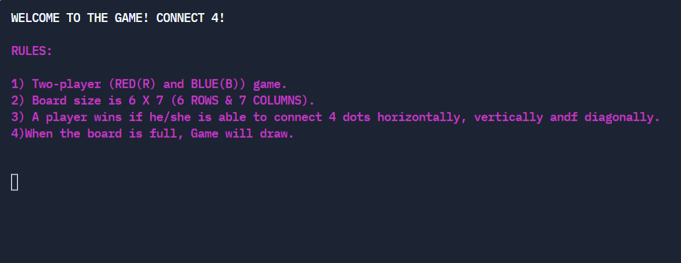
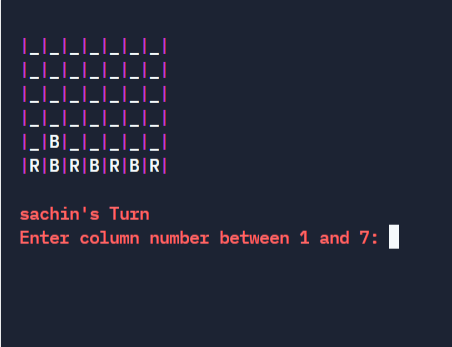
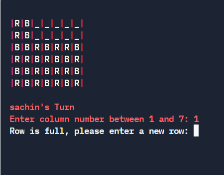
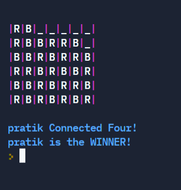

# Connect-4
It is a two-player connection board game, in which the players choose a color and then take turns dropping colored tokens into a seven-column, six-row vertical grid. And whoever made the same color line horizontally, vertically, or diagonally will win the game.

# Feature of the game
- Made with C++ Language.
- Used the concepts of OOPS.
- Used struct for the players.
- Used #define preprocessor directives for defining text colors.
- Used array to create the board.

